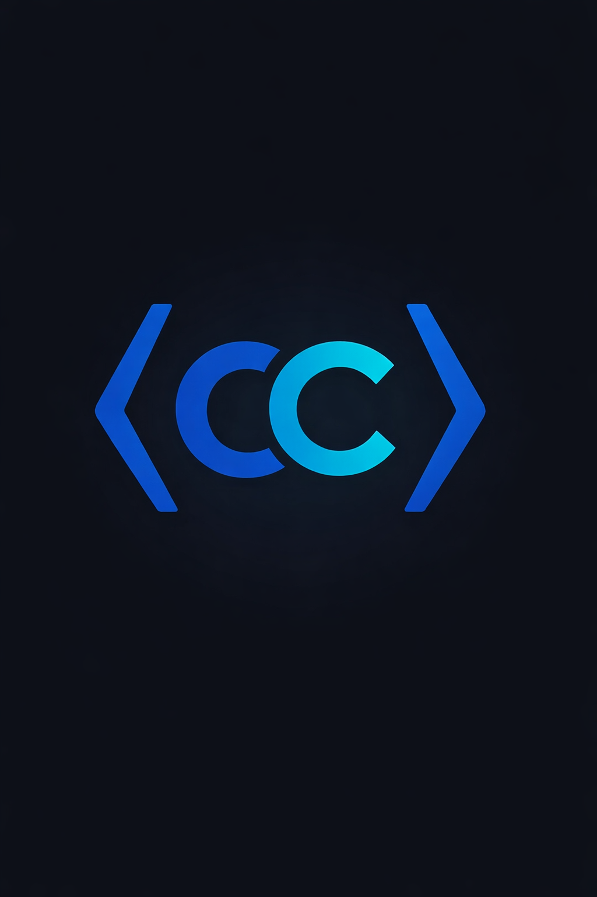

<div align="center">
   

   # 🚀 Copilot CoLab

   *"Real-time team collaboration for VS Code: tasks, chat, presence, AI."*

   <!-- Status Badges -->
   <p>
      
      
      
   </p>
   <!-- Meta Badges -->
   <p>
      
      
      
      
   </p>


   <br/><br/>
</div>

<!-- Demo Video -->
<div align="center">
   <a href="https://youtu.be/O-yuJCzHZVY" target="_blank">
      
   </a>
   <br/>
   <a href="https://youtu.be/O-yuJCzHZVY" target="_blank">▶️ Watch Demo on YouTube</a>
</div>

<details><summary>📋 Table of Contents</summary>

- [why-copilot-colab](#why-copilot-colab)
- [features](#features)
- [built-with](#built-with)
- [getting-started](#getting-started)
- [usage](#usage)
- [configuration](#configuration)
- [roadmap](#roadmap)
- [contributing](#contributing)
- [license](#license)
- [acknowledgements](#acknowledgements)
- [footer](#footer)

</details>

## Why Copilot CoLab?

**Juggling tasks, chat, and code context across apps kills developer flow.**

Most teams use separate tools for project management, chat, and code review. This fragments collaboration, slows feedback, and leaves context scattered. Copilot CoLab brings everything into VS Code, so your team stays focused and connected.

With real-time sync, AI-powered task generation, and secure Supabase backend, Copilot CoLab replaces the patchwork of apps with a single, developer-first workspace. No more lost context, no more switching tabs.

| Feature / Aspect         | Copilot CoLab | Slack/Asana | GitHub Projects |
| :---------------------- | :-----------: | :---------: | :-------------: |
| Real-time Kanban Board  |      ✅       |     ❌      |      ⚠️        |
| Team Chat in Editor     |      ✅       |     ✅      |      ❌        |
| Presence Tracking       |      ✅       |     ✅      |      ❌        |
| AI Task Generation      |      ✅       |     ❌      |      ❌        |
| Secure RLS Backend      |      ✅       |     ❌      |      ✅        |
| VS Code Integration     |      ✅       |     ❌      |      ⚠️        |

**Bottom line:** Copilot CoLab unifies collaboration, context, and AI—right where you code.

## ✨ Features

### 🔷 Kanban Task Board
Organize, assign, and update tasks in real time. Stay on top of work without leaving VS Code.

### 🔷 Team Chat
Chat with teammates directly in your editor. No more switching apps for quick feedback.

### 🔷 Presence Tracking
See who's online or idle. Know when your team is available for instant collaboration.

---

### 🔷 AI Assistance
Generate work breakdowns or digests using Gemini and GitHub context. Let AI handle the heavy lifting.

### 🔷 Secure Auth & RLS
Login with Google, GitHub, or email. All actions are protected by row-level security.

### 🔷 Realtime Sync
Tasks, chat, and presence update instantly for all users. No refresh needed.

## 🛠️ Built With

<div align="center">
   
   
   
   
   
   
</div>

- **TypeScript:** Strong typing and modern syntax for maintainable extension code.
- **React:** Fast, component-driven UI for the webview.
- **Tailwind CSS:** Utility-first styling for rapid, consistent design.
- **Supabase:** Auth, Postgres, and Realtime for secure backend and live updates.
- **Gemini API:** AI-powered task generation and digests.
- **VS Code API:** Deep integration for native extension experience.

## 🚀 Getting Started

### Prerequisites
- Node.js >= 18.x
- VS Code >= 1.90.0
- Supabase project (with URL and anon key)

```bash
# Install Node.js
curl -fsSL https://nodejs.org/install.sh | bash
# Install VS Code
# https://code.visualstudio.com/download
```

### Installation
1. Clone the repo
      ```bash
      git clone https://github.com/n4bi10p/copilot-colab.git
      cd copilot-colab
      ```
2. Install dependencies
      ```bash
      npm install
      ```
3. Set up environment variables
      ```bash
      cp .env.example .env
      # Edit .env with your Supabase URL and Key
      ```
4. Build the extension and webview
      ```bash
      npm run build
      ```

### Quick Start
```bash
# Launch the extension in VS Code
npm run dev
# Press F5 to open Extension Development Host
```

> [!TIP] If you see a blank webview, check your .env and Supabase setup.

## 📖 Usage

### Basic: Open Dashboard
```bash
# In VS Code, open the command palette:
Copilot CoLab: Open Dashboard
```
See your team's tasks, chat, and presence in one place.

### Intermediate: Add a Task
```bash
# Use the task board UI or run:
Copilot CoLab: Create Task
```
Create, assign, and update tasks instantly.

### Advanced: AI WBS Generation
```bash
# Select "Generate WBS" in the AI panel
```
Let Gemini generate a work breakdown structure for your project.


<!-- Add a workflow GIF here showing the above in action -->

## ⚙️ Configuration

| Option           | Type    | Default | Description                                 |
| :--------------: | :-----: | :-----: | :------------------------------------------: |
| SUPABASE_URL     | string  | N/A     | Your Supabase project URL                    |
| SUPABASE_ANON_KEY| string  | N/A     | Supabase anon key used by extension auth     |
| GEMINI_API_KEY   | string  | N/A     | API key for Gemini AI                        |
| GEMINI_MODEL     | string  | gemini-1.5-flash | Gemini model for task/chat AI     |
| GITHUB_TOKEN     | string  | N/A     | GitHub API token for repo/PR operations      |
| GITHUB_REPOSITORY| string  | auto-detect | Fallback repo (`owner/repo`) if git detect fails |
| COPILOT_MODEL    | string  | gpt-4.1 | Copilot SDK model for selection suggestions  |
| COPILOT_CLI_URL  | string  | http://localhost:4321 | Copilot CLI server URL             |

```yaml
# .env example
SUPABASE_URL=https://your-project.supabase.co
SUPABASE_ANON_KEY=your-anon-key
GEMINI_API_KEY=your-gemini-key
GEMINI_MODEL=gemini-1.5-flash
GITHUB_TOKEN=ghp_xxx
GITHUB_REPOSITORY=owner/repo
COPILOT_MODEL=gpt-4.1
COPILOT_CLI_URL=http://localhost:4321
```

> [!WARNING] Never commit your Supabase or Gemini keys to public repos.

## 🔌 Backend Command Reference

The webview communicates with the extension host via `postMessage` → `vscode.commands.executeCommand`. Below are all registered backend commands:

### Auth
| Command | Description |
|---------|-------------|
| `copilotColab.auth.getSession` | Get current auth session |
| `copilotColab.auth.getUser` | Get current user |
| `copilotColab.auth.signInWithPassword` | Sign in with email + password |
| `copilotColab.auth.signUpWithPassword` | Sign up with email + password |
| `copilotColab.auth.signOut` | Sign out |
| `copilotColab.auth.signInWithOAuth` | OAuth sign in (GitHub/Google) |

### Chat
| Command | Description |
|---------|-------------|
| `copilotColab.messages.list` | Load messages for a project |
| `copilotColab.messages.send` | Send a message (triggers `@gemini` auto-reply) |
| `copilotColab.messages.sendAndList` | Send a message and return updated list (atomic) |
| `copilotColab.messages.subscribeState` | Get current messages + ensure realtime subscription |

### Tasks
| Command | Description |
|---------|-------------|
| `copilotColab.tasks.list` | List tasks for a project |
| `copilotColab.tasks.create` | Create a new task |
| `copilotColab.tasks.updateStatus` | Update task status (backlog/in_progress/done) |
| `copilotColab.tasks.updateAssignee` | Assign/unassign a task |

### AI
| Command | Description |
|---------|-------------|
| `copilotColab.ai.generateWbs` | Generate Work Breakdown Structure via Gemini |
| `copilotColab.ai.assignTasks` | AI-powered bulk task assignment to team members |
| `copilotColab.ai.assignTasksPrompt` | Prompt-driven assignment test from Command Palette |
| `copilotColab.ai.suggestFromSelection` | Suggest code from editor selection |

### GitHub
| Command | Description |
|---------|-------------|
| `copilotColab.github.repoSummary` | Get repository summary |
| `copilotColab.github.listOpenPrs` | List open pull requests |
| `copilotColab.github.createPr` | Create a pull request |
| `copilotColab.github.mergePr` | Merge a pull request |
| `copilotColab.github.commentPr` | Comment on a pull request |

### Project & Members
| Command | Description |
|---------|-------------|
| `copilotColab.project.create` | Create/resolve a project |
| `copilotColab.project.resolveForWorkspace` | Resolve/create project using workspace repo mapping |
| `copilotColab.member.invite` | Invite a member |
| `copilotColab.member.remove` | Remove a member |
| `copilotColab.member.list` | List project members |

### Presence & Realtime
| Command | Description |
|---------|-------------|
| `copilotColab.presence.upsert` | Update presence status |
| `copilotColab.realtime.subscribeProject` | Subscribe to realtime events (tasks, messages, presence) |
| `copilotColab.realtime.unsubscribeProject` | Unsubscribe from realtime events |
| `copilotColab.realtime.health` | Inspect current subscription status |

### Diagnostics
| Command | Description |
|---------|-------------|
| `copilotColab.backend.smokeTest` | Quick backend checks |
| `copilotColab.demo.healthcheck` | Demo readiness check (auth, project, github, messages, realtime) |

## ✅ Demo E2E Checklist

Run this sequence for a full demo validation:

1. Start local backend and apply migrations:
   - `npx supabase db push`
2. Build and run extension:
   - `npm run compile:extension`
   - `F5` (Extension Development Host)
3. Sign in from UI.
4. In `Team Setup`:
   - invite at least one member UUID
   - create starter tasks
   - run `Assign Tasks (Gemini)`
5. Send a chat message with `@gemini`.
6. Run `Copilot CoLab: Demo Healthcheck` from Command Palette.
7. Verify Output panel (`Copilot CoLab Backend`) has successful logs for assign/chat/realtime.

## 🗺️ Roadmap
Here's what's done and what's coming next.

#### ✅ Completed
- Supabase auth/session
- Project/member management
- Real-time tasks/messages/presence
- Extension commands wired to backend

#### 🔄 In Progress
- AI flow (WBS generator or digest generator)
- Reviewer agent with GitHub PR context

#### 🔮 Planned
- Conflict-risk hints
- Gamification/vibe log polish

See [open issues](https://github.com/n4bi10p/copilot-colab/issues) for a full list of proposed features and known bugs.

## 🤝 Contributing

We welcome all contributors!

1. Fork the repo
2. Clone your fork
3. Create a branch (`feat/your-feature`)
4. Commit using Conventional Commits
5. Push and open a PR

> [!IMPORTANT] Read CONTRIBUTING.md before submitting a PR

```bash
# Dev setup
npm install
npm test
npm run lint
```

[](https://github.com/n4bi10p/copilot-colab/issues?q=is%3Aissue+is%3Aopen+label%3A%22good+first+issue%22)

## 📄 License

Distributed under the MIT License. See LICENSE.txt for more information.


## 🔮 Future Scope

### 📬 Notification Layer
- [ ] **Bot Notifications** — Integrate WhatsApp, Telegram, and Discord bots to send real-time alerts and updates directly to your messaging platform. Stay informed wherever you are, without opening the app.

### 🤖 Bot-as-Interface
- [ ] **Two-Way Bot Communication** — Interact with the extension through WhatsApp, Telegram, or Discord bots. Send commands, trigger actions, and receive responses from chat, without opening the extension UI.
- [ ] **OpenClaw-Style Bot Experience** — A dedicated bot will act as a conversational interface to the extension, letting you query data, manage tasks, and control features using natural chat commands.

> [!NOTE] Interested in building this? Check open issues tagged `bot-integration` and jump in.


<div align="center">
   
   
   
</div>

---

<div align="center">
   ⭐ Star this repo if you find it useful!
   <br/>
   Made with ❤️ by [Aman, Nabil, Bhumi] 
   <br/>
